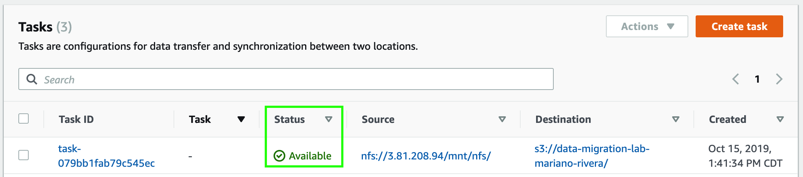

1. Asegúrese de estar trabajando en la región de **_N. Virgina_**. Esto lo puede verificar en el menú desplegable que se encuentra en la esquina superior derecha de la consola de AWS.
2. Haga click en **_Services_** y después en [**_DataSync_**](https://console.aws.amazon.com/datasync/) que se encuentra bajo la categoría de **_Migration & Transer_** (**_https://console.aws.amazon.com/datasync/_**).
3. Haga clck en **_Agents_** en el menú lateral de la izquierda.
4. Haga click en **_Create agent_**.
5. En **_Service Endpoints_** seleccione **_Public service endpoints in US East (N. Virginia)_**.
6. En el campo de **_Agent address_** ingrese la dirección IP de **_DataSyncAgentIP_** que guardó en el editor de texto.
7. Haga click en **_Get key_**
8. En el campo de **_Agent name_** ingrese el nombre de su agente (**_DataSync Agent - Lab_**)
9. Haga click en **_Create agent_**.

Una vez que su agente ha sido creado, debe crear una tarea de migración (task) en donde definirá el origen y destino de los datos que va a migrar.

10. Haga clck en **_Tasks_** en el menú lateral de la izquierda.
11. Haga click en **_Create task_**.
12. En **_Location_** type seleccione **_Network File System (NFS)_**.
13. En **_Agents_** seleccione el agente de DataSync que acaba de crear.
14. En **_NFS Server_** ingrese la IP de **_NFSInstancePublicIP_** que guardó en el editor de texto.
15. En **_Mount path_** ingrese la siguiente ruta:

```
/mnt/nfs
```

16. Haga click en **_Next_**.
17. En **_Location type_** seleccione **_Amazon S3 bucket_**.
18. En **_S3 bucket_** seleccione el bucket que creó anteriormente.
19. En **_IAM role_** haga click en **_Autogenerate_** para generar un rol que permita a DataSync interactur con su bucket.
20. Haga click en **_Next_**.
21. En la siguiente pantalla deje los valores predeterminados y haga click en **_Next_**.
22. Haga click en **_Create task_**.
23. Haga clck en **_Tasks_** en el menú lateral de la izquierda. Podrá ver que el status de la tarea es **_Creating_**.


24. Espere unos minutos a que el status de la tarea cambie a **_Available_** y proceda al siguiente mód

