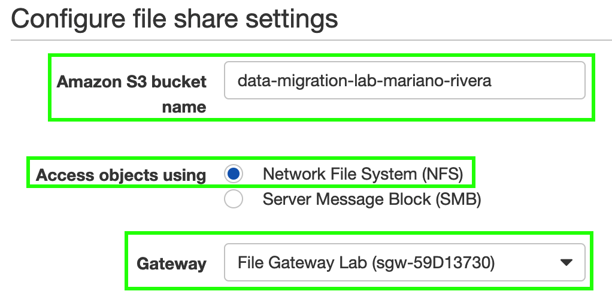
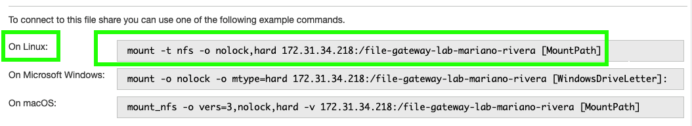

1. Haga click en **_Services_** y después en [**_Storage Gateway_**](https://console.aws.amazon.com/storagegateway/) que se encuentra bajo la categoría de **_Storage_** (**_https://console.aws.amazon.com/storagegateway/_**).
2. Cambie a la región de **_N. Virginia_** en la esquina superior derecha de la consola de AWS.
3. Haga click en **_File Shares_** en el menú lateral del lado izquierdo.
4. Haga click en **_Create file share_**.
5. En el campo de **_Amazon S3 bucket name_** ingrese el nombre del bucket de S3 que creó para este laboratorio.
6. En la opción de **_Access objects using_** seleccione **_Network File System (NFS)_**.
7. En el menú desplegable de **_Gateway_** seleccione el Gateway que creó anteriormente.

8. Haga click en **_Next_**.
9. En la pantalla de **_Configure how files are stored in Amazon S3_** haga click en **_Next_** (usará los valores predeterminados).
10. En la pantalla de **_Review_** haga click en **_Create file share_**.
11. Haga click en **_File Shares_** en el menú lateral del lado izquierdo.
12. Seleccione la casilla del share que acaba de crear.
13. Copie las instrucciones para conectarse a su file share desde una máquina **_Linux_** y guárdelas en un editor de texto ya que las utilizará más adelante.

14. Proceda al [**_siguiente módulo_**](http://data-migration.oldschool.cloud/mount/)