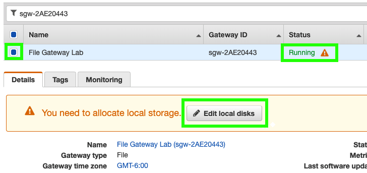

1. Haga click en **_Services_** y después en **_Storage Gateway_** que se encuentra bajo la categoría de [**_Storage_**](https://console.aws.amazon.com/storagegateway/) (**_https://console.aws.amazon.com/storagegateway/_**).
2. Haga click en **_Get Started_** o **_Create Gateway_** según sea el caso.
3. En **_Select gateway type_** seleccione **_File Gateway_** y haga click en **_Next_**.
4. En **_Select host platform_** seleccione **_Amazon EC2_** y haga click en **_Next_**.
5. En **_Service endpoint_** seleccione **_Public_** y haga click en **_Next_**.
6. En **_Connect to gateway_** ingrese la IP de **_StorageGatewayPublicIp_** en el campo de **_IP address_**y haga click en **_Next_**.
7. En Activate Gateway seleccione la zona horaria de su localidad en el menú desplegable de Gateway time zone.
8. Ingrese un nombre para su Gateway (ejemplo: **_File Gateway Lab_**) en el campo de **_Gateway name_**.
9. Haga click en **_Activate Gateway_**.
10. Haga click en **_Exit_**.
11. Haga click en **_Gateways_** en el menú lateral del lado **_izquierda_**.
12. Seleccione la casilla del **_Gateway_** que acaba de crear y asegúrese que el status de su Gateway sea **_Running_** (con un signo de exclamación a un lado).
13.	Haga click en **_Edit local disks_**.

14.	Elija **_Cache_** del menú desplegable de **_Allocated to_**.
15.	Haga click en **_Save_**.

