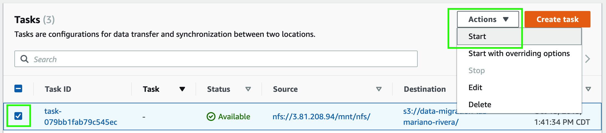
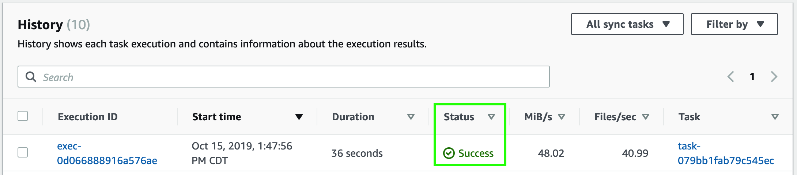
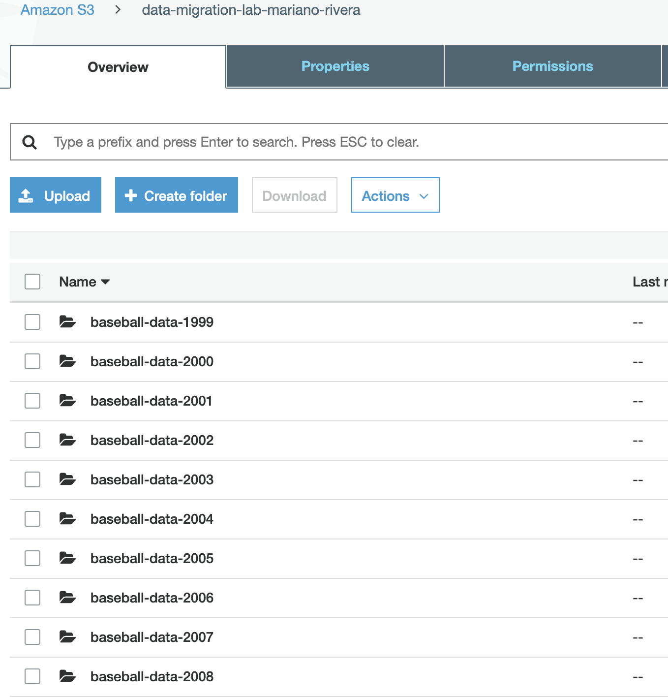

25. Seleccione la casilla de su tarea.
26. Haga click en el menú desplegable de **_Actions_**.

27. Haga click en **_Start_**. Podrá ver como el status de su tarea cambió a **_Running_**. Espere unos minutos a que la tarea de migración se ejecute y el status de su tarea cambie de nuevo a **_Available_**.

28. Una vez que el status de su tarea cambie de nuevo a **_Available_** haga click en **_History_** bajo **_Tasks_** en el menú lateal de la izquierda. Aquī podrá corroborar que su tarea de migración se ejecutó satisfactoriamente.

29. Haga click en **_Services_** y posteriormente seleccione el servicio de [**_S3_**](https://s3.console.aws.amazon.com/) el cual se encuentra bajo la categoría de **_Storage_** (**_https://s3.console.aws.amazon.com/_**).
30. Haga click en el bucket que creó para este laboratorio. Podrá corroborar que los datos se migraron satisfactoriamente, verá algo así:

