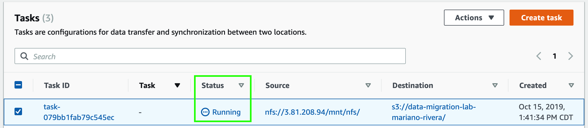

1. Haga clck en **_Tasks_** en el menú lateral de la izquierda.
2. Seleccione la casilla de su tarea.
3. Asegúrese que el status de su tarea sea **_Available_**.
3. Haga click en el menú desplegable de **_Actions_**.

4. Haga click en **_Start_**. Podrá ver como el status de su tarea cambió a **_Running_**. Espere unos minutos a que la tarea de migración se ejecute y el status de su tarea cambie de nuevo a **_Available_**.

5. Una vez que el status de su tarea cambie de nuevo a **_Available_** haga click en **_History_** bajo **_Tasks_** en el menú lateral de la izquierda. Aquí podrá corroborar que su tarea de migración se ejecutó satisfactoriamente.

6. Haga click en **_Services_** y posteriormente seleccione el servicio de [**_S3_**](https://s3.console.aws.amazon.com/) el cual se encuentra bajo la categoría de **_Storage_** (**_https://s3.console.aws.amazon.com/_**).
7. Haga click en el bucket que creó para este laboratorio. Podrá corroborar que los datos se migraron existosamente; verá algo así:

