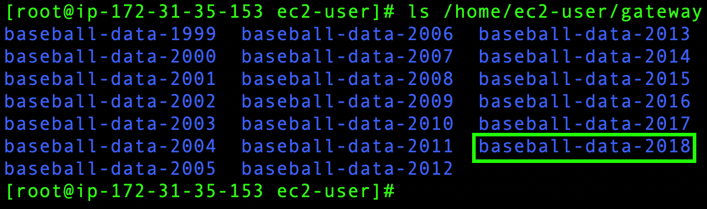
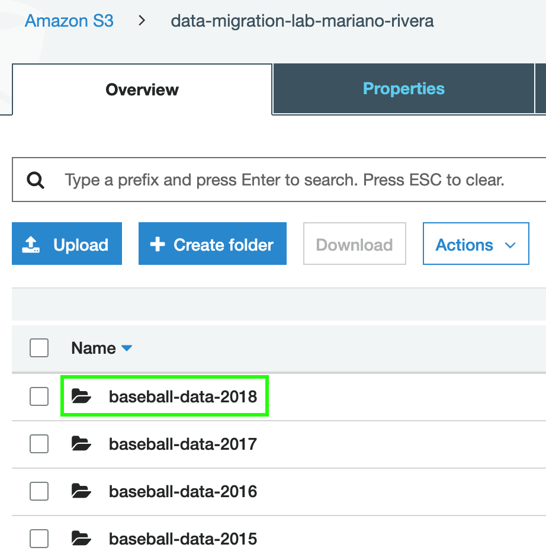

1. Haga click en **_Services_** y posteriormente seleccione el servicio de [**_EC2_**](https://console.aws.amazon.com/ec2/) el cual se encuentra bajo la categoría de Compute (**_https://console.aws.amazon.com/ec2/_**) .
2. Cambie a la región de **_N. Virginia_** en la esquina superior derecha.
3. Haga click en **_Running instances_**.
4. Seleccione la casilla que se encuentra a lado de la instancia **_Amazon Linux 2 - SGW Lab_**.
5. Haga click en **_Connect_**.
6. Seleccione **_EC2 Instance Connect (browser-based SSH connection)_** y haga click en **_Connect_** para tener acceso a su instancia vía SSH por medio del navegador web.


**_*Nota_**. Si por alguna razón no pudo conectarse a la instancia por medio de SSH via el navegador web (500 Server error), intente la opción de A standalone SSH client siguiendo las instrucciones que ahí se indican (terminal para usuarios Mac/Linux, putty para usuarios Windows).

7. Ejecute el siguiente comando para obtener privilegio root:

```
sudo su
```

8. Para montar su file share debe crear un directorio en donde montarlo; para esto jecute el siguiente comando:

```
mkdir /home/ec2-user/gateway
```

9. Ejecute el comando que guardó en el editor de texto para montar el file share en Linux sustituyendo **_[MounthPath]_** por la siguiente ruta:

```
/home/ec2-user/gateway
```

10. Ejecute el siguiente comando para enlistar el contenido de la carpeta compartida que acaba de montar (si llevó a cabo el laboratorio de DataSync encontrará los archivos que migró anteriormente):

```
ls /home/ec2-user/gateway
```

11. Dentro de la ruta en la que se encuentra hay un directorio llamado **baseball-data-2018** que contiene archivos .csv con estadísticas de baseball. Ejecute el siguiente comando para copiar estos archivos al file share que acaba de montar:

```
cp -rv /home/ec2-user/baseball-data-2018/ /home/ec2-user/gateway/
```

12. Ejecute de nuevo el comando **_ls /home/ec2-user/gateway_** para corroborar que el directorio **baseball-data-2018** se copió correctamente al file share.



13.	Haga click en **_Services_** y después en [**_S3_**](https://console.aws.amazon.com/storagegateway/).
14.	Ingrese al bucket que creó para este laboratorio.
15.	Verifique que el directorio que copió se encuentra en el bucket.


