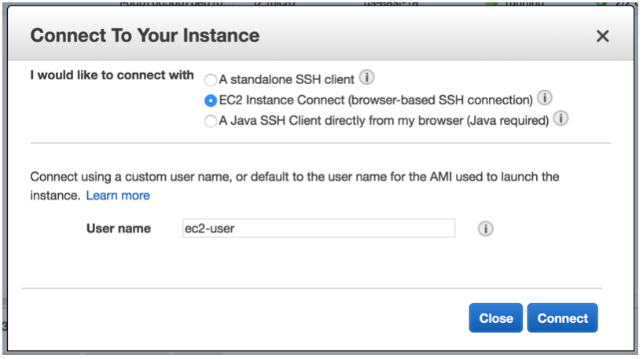
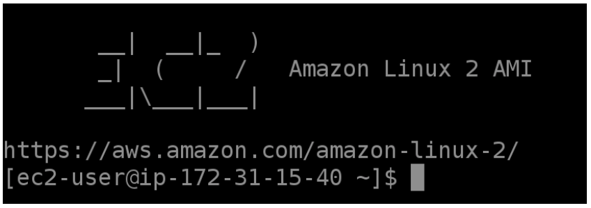

1. Haga click en **_Services_** y posteriormente seleccione el servicio de [**_EC2_**](https://console.aws.amazon.com/ec2/) el cual se encuentra bajo la categoría de Compute (**_https://console.aws.amazon.com/ec2/_**) .
2. Cambie a la región de **_N. Virginia_** en la esquina superior derecha.
3. Haga click en **_Running instances_**.
4. Seleccione la casilla que se encuentra a lado de la instancia **_Amazon Linux 2 - SGW Lab_**.
5. Haga click en **_Connect_**.
6. Seleccione **_EC2 Instance Connect (browser-based SSH connection)_** y haga click en **_Connect_** para tener acceso a su instancia vía SSH por medio del navegador web.






**_*Nota_**. Si por alguna razón no pudo conectarse a la instancia por medio de SSH via el navegador web (500 Server error), intente la opción de A standalone SSH client siguiendo las instrucciones que ahí se indican (terminal para usuarios Mac/Linux, putty para usuarios Windows).

7. Ejecute los siguientes comandos:

```
mkdir Gateway
```
```
wget https://awsimmersiondays.s3.amazonaws.com/baseballdatabank-2019.2.zip
```
```
unzip baseballdatabank-2019.2.zip
```
```
sudo su
```

8. Ejecute el comando que guardó en el editor de texto para montar el file share en Linux sustituyendo **_[MounthPath]_** por **_/home/ec2-user/Gateway_**. Deberá quedar algo así:

> mount -t nfs -o nolock,hard 172.31.34.218:/file-gateway-lab-su-bucket /home/ec2-user/gateway

9. Ejecute los siguientes comandos:

```
exit
```
```
cp -rv /home/ec2-user/baseballdatabank-2019.2/* /home/ec2-user/gateway/
```

10.	Haga click en **_Services_** y después en [**_S3_**](https://console.aws.amazon.com/storagegateway/).
11.	Ingrese al bucket que creó para este laboratorio.
12.	Verifique que los archivos que copió se encuentran en el bucket.
