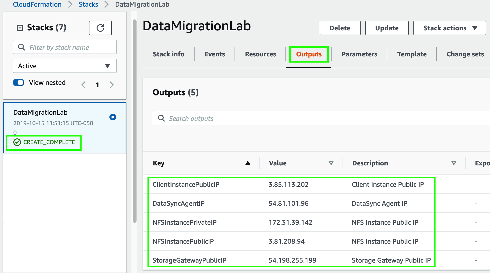

Lo primero que debe hacer es crear un key pair. Este key pair le permitirá acceder a la instancia que creará más adelante en la cual va a montar la carpeta compartida que va a crear con el servicio de Storage Gateway.

1. Cambie a la región de **_N. Virginia_** en la esquina superior derecha de la consola de AWS.
2. Haga click en **_Services_** y posteriormente seleccione el servicio de [**_EC2_**](https://console.aws.amazon.com/ec2/) el cual se encuentra bajo la categoría de **_Compute_** - **_https://console.aws.amazon.com/ec2/_**.
3. Una vez en EC2, haga click en la sección de **_Key Pairs_** que se encuentra en el menú lateral de la izquierda y posteriormente haga click en **_Create key pair_**.
4. En el campo de **_Key pair name_** ingrese un nombre para su key pair (ejemplo: **_sgw-lab_**).
5. Haga click en **_Create_** y guarde el archivo que se va a descargar.

A continuación, va a desplegar una plantilla de CloudFormation que instalará una instancia de Amazon Linux 2, aplicará las actualizaciones de sistema operativo correspondientes y configurar un security group con el puerto 22 (ssh) habilitado. En esta instancia es donde va a montar los file shares creados con el servicio de Storage Gateway. Esta plantilla también deplegará la instancia que utilizará como Storage Gateway y configurará el security group correspondiente para servicios NFS y SMB. Para desplegar dicha plantilla siga los siguientes pasos:

6. Haga click en **_Services_** y después en **_CloudFormation_** que se encuentra bajo la categoría de **_Management & Governance_** (también puede teclear CloudFormation en el campo de búsqueda).
7. Haga click en **_Create stack_**.
8. En el campo de **_Amazon S3 URL_** ingrese la siguiente URL: **_https://s3.amazonaws.com/storage-gateway.oldschool.cloud/sgw.yaml_**
9. Haga click en **_Next_**.
10. En el campo de **_Stack name_** escriba **_StorageGatewayLab_**.
11. En el menú desplegable de **_KeyPair_** bajo la sección de **_Parameters_** elija el key pair que creó anteriormente (**_sgw-lab_**).
12. Haga click en **_Next_**.
13. En la siguiente pantalla haga click de nuevo en **_Next_**.
14. En la siguiente pantalla haga click en **_Create stack_**.
15. Espere unos minutos a que el status de lanzamiento de la plantilla indique **_CREATE_COMPLETE_**.
16. Una vez que el lanzamiento haya sido completado, haga click en la sección de **_Outputs_** y copie los valores de **_EC2InstancePublicIp_** y **_StorageGatewayPublicIp_**. Guarde estas IPs en un editor de texto ya que las utilizará más adelante.

