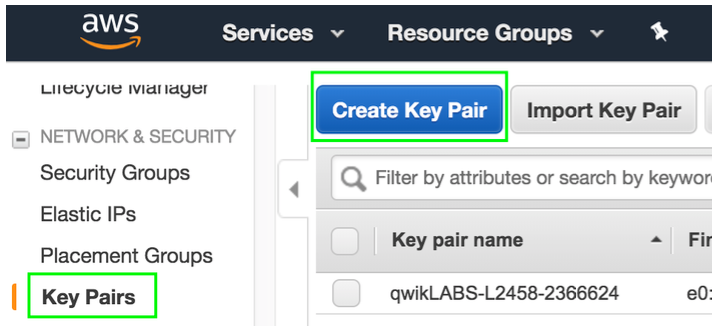
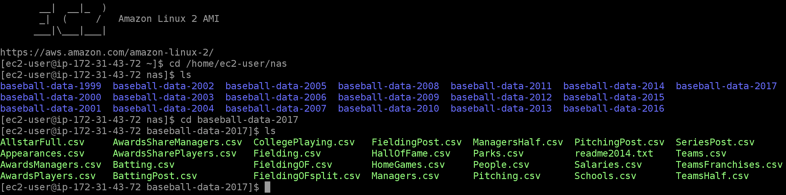

Lo primero que debe hacer es crear un key pair. Este key pair le permitirá acceder a la instancia que creará más adelante y a la cual le mostrará el file share que creará con el servicio de Storage Gateway.

1. Asegúrese de estar trabajando en la región de **_N. Virgina_**. Esto lo puede verificar en el menú desplegable que se encuentra en la esquina superior derecha de la consola de AWS.
2. Haga click en **_Services_** y posteriormente seleccione el servicio de [**_EC2_**](https://console.aws.amazon.com/ec2/) el cual se encuentra bajo la categoría de **_Compute_** - **_https://console.aws.amazon.com/ec2/_**.
3. Una vez en EC2, haga click en la sección de **_Key Pairs_** que se encuentra en el menú de la izquierda.
5. Haga click en **_Create key pair_**.



6. En el campo de **_Key pair name_** ingrese un nombre para su key pair (ejemplo: **_dm-lab_**).
7. Haga click en **_Create_** y guarde el archivo que se va a descargar.

A continuación, va a desplegar una plantilla de CloudFormation. Esta plantilla deplegará una instancia de Linux Amazon 2 con su grupo de seguridad correspondiente con el puerto 22 habilitado (ssh). En esta instancia usted montará un file share que creará utilizando el servicio de Storage Gateway. Esta plantilla también desplegará una segunda instancia de EC2, que es la que usted configurará como Storage gateway, y creará el grupo de seguridad necesario con los servicios de HTTP, NFS y SMB habilitados.

8. Haga click en **_Services_** y después en [**_CloudFormation_**](https://console.aws.amazon.com/cloudformation/) que se encuentra bajo la categoría de **_Management & Governance_** (también puede teclear CloudFormation en el campo de búsqueda) - **_https://console.aws.amazon.com/cloudformation/_**.
9. Haga click en **_Create stack_**.
10.	En el campo de **_Amazon S3 URL_** ingrese la siguiente URL: 

```
http://data-migration.oldschool.cloud/data-migration-lab.yaml
```

11.	Haga click en **_Next_**.
12.	En el campo de **_Stack name_** escriba **_DataMigrationLab_**.
13.	En el menú desplegable de **_KeyPair_** bajo la sección de **_Parameters_** elija el key pair que creó anteriormente (**_dm-lab_**).
14.	Haga click en **_Next_**.
14.	En la siguiente pantalla haga click de nuevo en **_Next_**.
16.	En la siguiente pantalla haga click en **_Create stack_**.
17.	Espere unos minutos a que el status de lanzamiento de la plantilla indique **_CREATE_COMPLETE_**.
18.	Una vez que el despliegue de la plantilla haya sido completado, haga click en la sección de **_Outputs_** y copie los parámetros que ahí se encuentran (**_ClientInstancePublicIP, DataSyncAgentIP, etc._**) junto con sus valores (las direcciones IPs) y guárdelos en un editor de texto ya que las utilizará más adelante.


A continuación, debe crear un bucket de S3 que nos servirá para almacenar la información que migremos utilizando los Servicios de DataSync y Storage Gateway.

19. Cambie a la región de **_Ohio_** en la esquina superior derecha de la consola de AWS.
20. Haga click en **_Services_** y posteriormente seleccione el servicio de [**_S3_**](https://s3.console.aws.amazon.com/) el cual se encuentra bajo la categoría de **_Storage_** (**_https://s3.console.aws.amazon.com/_**).
21. Haga click en **_+ Create bucket_**.
22. Ingrese un nombre para su bucket en **_Bucket name_** con la siguiente nomenclatura: **_data-migration-lab-su-nombre_** (ejemplo: **_data-migration-lab-mariano-rivera_**).
23. Haga click en **_Create_**.
24. Guarde el nombre de su bucket en un editor de texto ya que lo utilizará más tarde.


25. Haga click en **_Services_** y posteriormente seleccione el servicio de **_EC2_** el cual se encuentra bajo la categoría de **_Compute_**.
26. Haga click en **_Running instances_**.
27. Seleccione la casilla que se encuentra a lado de la instancia **_Linux Server_**.
28. Haga click en **_Connect_**.
29. Seleccione **_EC2 Instance Connect (browser-based SSH connection)_** y haga click en **_Connect_** para tener acceso a la instancia cliente vía SSH por medio del navegador web.


**_*Nota._** Si por alguna razón no pudo conectarse a la instancia por medio de SSH via el navegador web (500 Server error), intente la opción de A standalone SSH client siguiendo las instrucciones que ahí se indican (terminal para usuarios Mac/Linux, putty para usuarios Windows).

30. Una vez conectado a su instancia cliente ejecute el siguiente comando sustituyendo el parámetro **_NFSInstancePrivateIP_** por la dirección IP correspondiente que guardó en el editor de texto:

```
sudo mount -t nfs NFSInstancePrivateIP:/mnt/nfs /home/ec2-user/nas
```

Este comando va a montar una carpeta compartida por la instancia que funge como servidor NFS.

31. Proceda a explorar el contenido de esta carpeta con los siguientes comandos:

Para acceder a la carpeta
```
cd /home/ec2-user/nas
```

Para enlistar el contenido
```
ls
```

En esta carpeta encontrará información histórica con estadísticas de baseball de los últimos 20 años la cual migrará al servicio de S3 utilizando DataSync.

