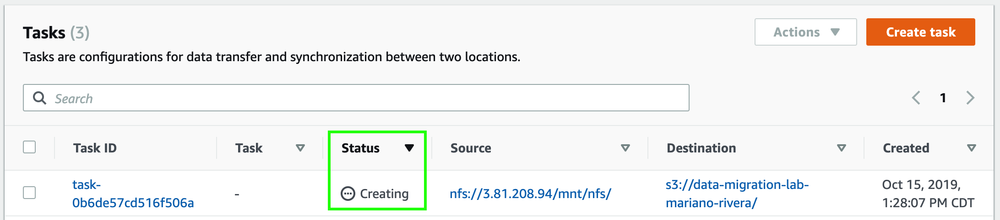

Una vez que su agente ha sido creado, debe crear una tarea (task) en donde definirá el origen y destino de los datos que va a migrar.

1. Haga click en **_Tasks_** en el menú lateral de la izquierda.
2. Haga click en **_Create task_**.
3. En **_Location type_** seleccione **_Network File System (NFS)_**.
4. En **_Agents_** seleccione el agente de DataSync que acaba de crear.
5. En **_NFS Server_** ingrese la IP del parámetro **_NFSInstancePrivateIP_** que guardó en el editor de texto.
6. En **_Mount path_** ingrese la siguiente ruta:

```
/mnt/nfs
```


7. Haga click en **_Next_**.
8. En **_Location type_** seleccione **_Amazon S3 bucket_**.
9. En **_S3 bucket_** seleccione el bucket que creó anteriormente.
10. En **_IAM role_** haga click en **_Autogenerate_** para generar un rol que permita a DataSync interactuar con su bucket.


11. Haga click en **_Next_**.
12. En la siguiente pantalla deje los valores predeterminados y haga click en **_Next_**.
13. Haga click en **_Create task_**.
14. Haga click en **_Tasks_** en el menú lateral de la izquierda. Podrá ver que el status de la tarea es **_Creating_**.



15. Espere unos minutos a que el status de la tarea cambie a **_Available_** y proceda al [**_siguiente módulo_**](http://data-migration.oldschool.cloud/transfer/).

